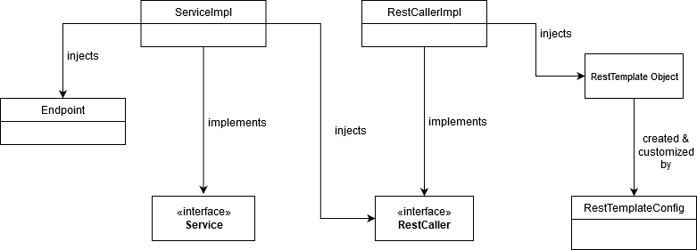
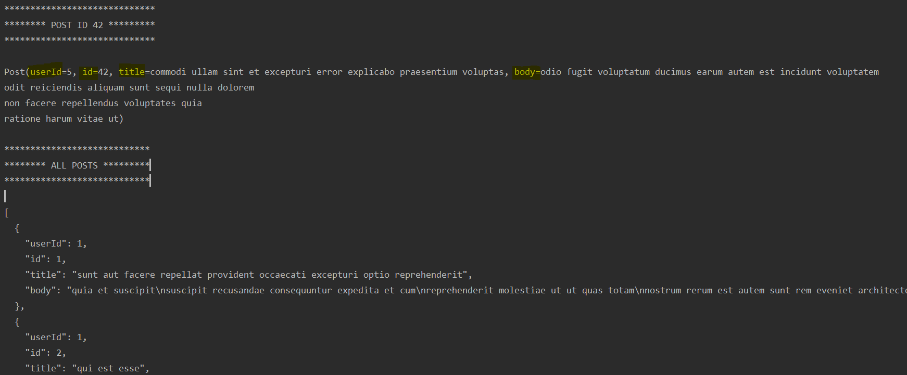

# Spring Rest Template with Java Generics
Spring Rest Template implemented with Java Generics in this project. 3 types of REST method(GET,POST and PUT) is used 
to retrieve response in the generic way.

## Details
* Two GET call is made to test API by the given URLs below that included in project's "application.properties" file -> 
http://jsonplaceholder.typicode.com/posts && http://jsonplaceholder.typicode.com/posts/42

These URLs are set in ***/config/Endpoint.java

* Generics are defined in **/rest/RestCaller.java and implemented in **/rest/RestCallerImpl.java. Injected by **/service/ServiceCallImpl.java

* Lombok API added to make the code easier for reading.


## UML Diagram




## How to test?

It's enough to run application. Two way of making GET call implemented in program's main method -->

```java
	public static void main(String[] args) {
		ApplicationContext context = SpringApplication.run(SpringGenericRestTemplateApplication.class, args);

		ServiceCallImpl serviceCall = context.getBean(ServiceCallImpl.class);

		System.out.println("\n*****************************");
		System.out.println("******** POST ID 42 *********");
		System.out.println("*****************************\n");
		System.out.println(serviceCall.sampleGetServiceCallWithObjResponse());
		System.out.println("\n****************************");
		System.out.println("******** ALL POSTS *********");
		System.out.println("****************************\n");
		System.out.println(serviceCall.sampleGetServiceCallWithStringResponse());
	}
```

## Result


